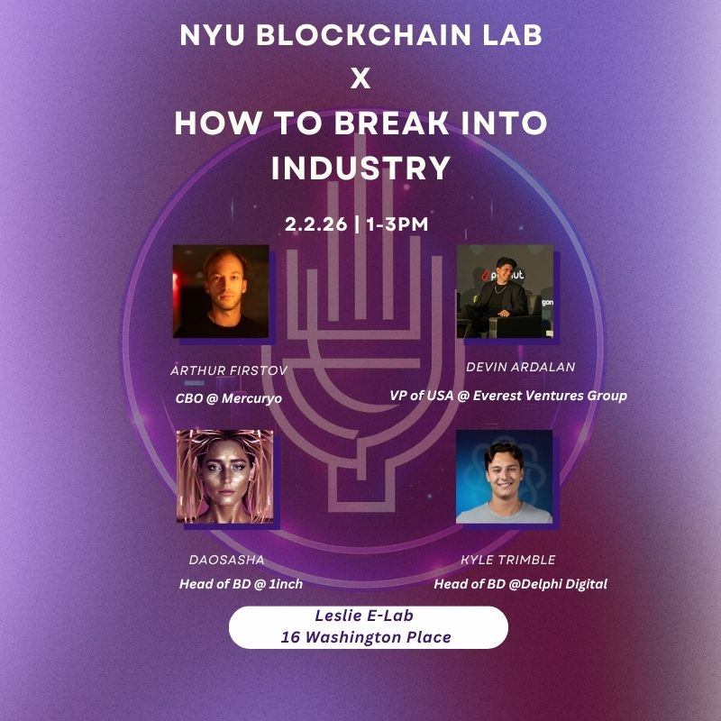
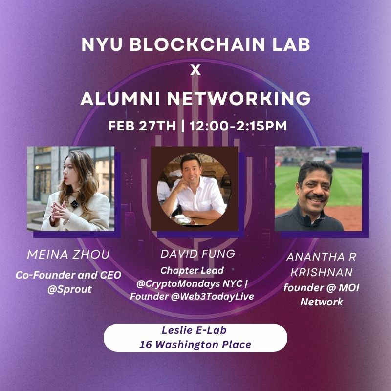
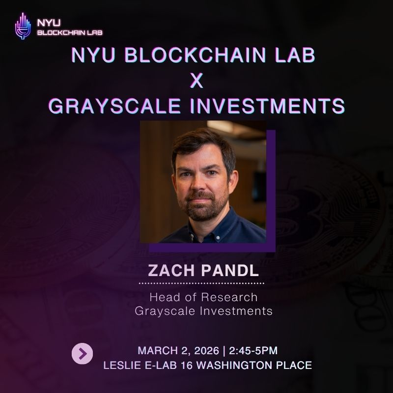
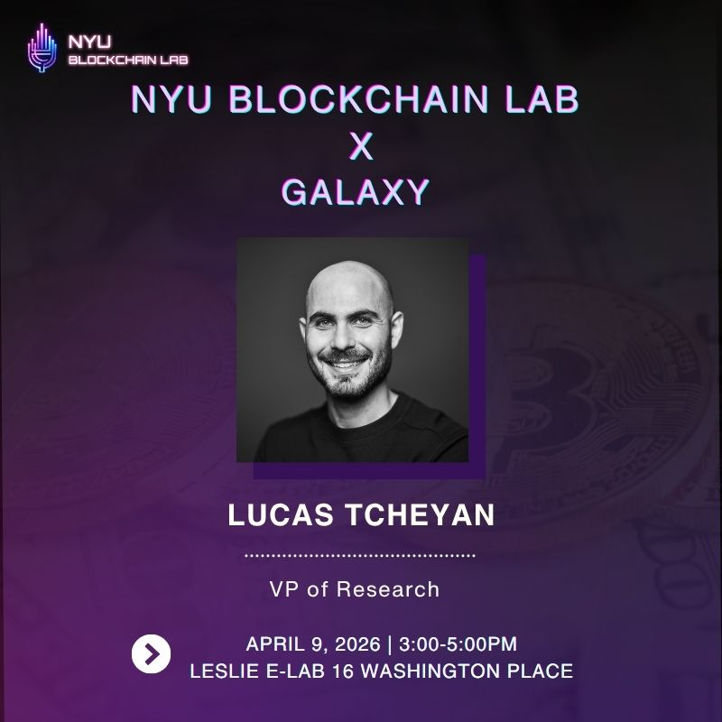
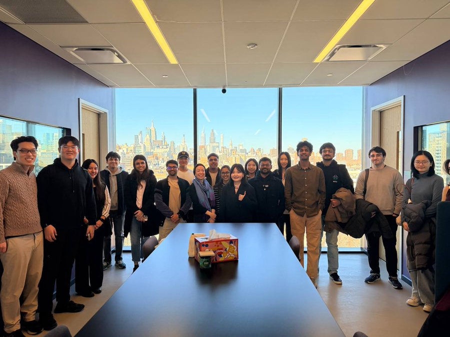
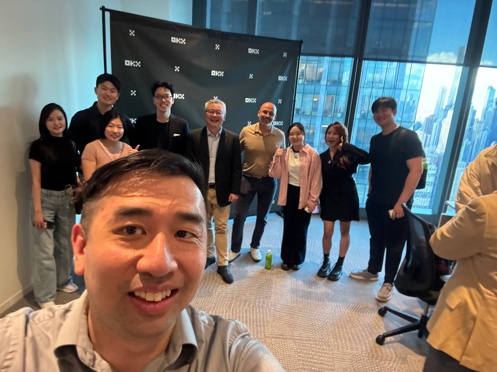

[index.html](https://github.com/user-attachments/files/27312604/index.html)
<!DOCTYPE html>
<html lang="en">
<head>
<meta charset="UTF-8">
<meta name="viewport" content="width=device-width, initial-scale=1.0">
<title>Ukaverse — Yiheng (Uka) Zhu</title>
<link rel="preconnect" href="https://fonts.googleapis.com">
<link rel="preconnect" href="https://fonts.gstatic.com" crossorigin>
<link href="https://fonts.googleapis.com/css2?family=Fraunces:ital,opsz,wght@0,9..144,300;0,9..144,400;0,9..144,500;1,9..144,300;1,9..144,400&family=DM+Sans:wght@300;400;500&display=swap" rel="stylesheet">

</head>
<body>

<!-- NAV -->
<nav>
  

    <a class="nav-logo" href="#">Ukaverse</a>
    

      <!-- LinkedIn -->
      <a href="https://www.linkedin.com/in/ukaaa/" target="_blank" class="nav-social" aria-label="LinkedIn">
        <svg viewBox="0 0 24 24" xmlns="http://www.w3.org/2000/svg">
          <path d="M20.447 20.452h-3.554v-5.569c0-1.328-.027-3.037-1.852-3.037-1.853 0-2.136 1.445-2.136 2.939v5.667H9.351V9h3.414v1.561h.046c.477-.9 1.637-1.85 3.37-1.85 3.601 0 4.267 2.37 4.267 5.455v6.286zM5.337 7.433a2.062 2.062 0 0 1-2.063-2.065 2.064 2.064 0 1 1 2.063 2.065zm1.782 13.019H3.555V9h3.564v11.452zM22.225 0H1.771C.792 0 0 .774 0 1.729v20.542C0 23.227.792 24 1.771 24h20.451C23.2 24 24 23.227 24 22.271V1.729C24 .774 23.2 0 22.222 0h.003z"/>
        </svg>
      </a>
      <!-- X / Twitter -->
      <a href="https://x.com/Ukaverse22" target="_blank" class="nav-social" aria-label="Twitter / X">
        <svg viewBox="0 0 24 24" xmlns="http://www.w3.org/2000/svg">
          <path d="M18.244 2.25h3.308l-7.227 8.26 8.502 11.24H16.17l-4.714-6.231-5.401 6.231H2.744l7.737-8.835L1.254 2.25H8.08l4.253 5.622 5.911-5.622zm-1.161 17.52h1.833L7.084 4.126H5.117z"/>
        </svg>
      </a>
      <!-- Email -->
      <a href="mailto:yz11354@nyu.edu" class="nav-social" aria-label="Email">
        <svg viewBox="0 0 24 24" xmlns="http://www.w3.org/2000/svg">
          <path d="M20 4H4c-1.1 0-2 .9-2 2v12c0 1.1.9 2 2 2h16c1.1 0 2-.9 2-2V6c0-1.1-.9-2-2-2zm0 4-8 5-8-5V6l8 5 8-5v2z"/>
        </svg>
      </a>
    

  

  <ul class="nav-links">
    <li><a href="#work">Work</a></li>
    <li><a href="#events">Events</a></li>
    <li><a href="#thinking">Thinking</a></li>
    <li><a href="#contact">Contact</a></li>
  </ul>
</nav>

<main class="page">

  <!-- ── HERO ── -->
  

    

      
Ecosystem Builder · NYC

      <h1>
        Complex systems. 
        Clear strategy. 
        <em>Real execution.</em>
      </h1>
      

        I work where ideas become infrastructure —
        building ecosystems in <strong>Web3 and AI</strong>,
        translating ambiguity into strategy,
        and connecting people who should already know each other.
      

      

        <a href="cv.pdf" target="_blank" class="btn-primary">Download CV ↓</a>
        <a href="#work" class="btn-ghost">View Work →</a>
      

    

    

      
    

  

  <!-- ── WHAT I DO ── -->
  <section id="capabilities">
    

      01
      <h2 class="section-title">What I Do</h2>
    

    

      

        
Ecosystem Building

        

          <h3>I build communities that actually do things.</h3>
          
Not just audiences — operational networks. I connect students with industry, ideas with capital, and builders with each other. At NYU Blockchain Lab, I turned a student org into a recognized node in NYC's digital assets ecosystem.

        

      

      

        
Strategy & Execution

        

          <h3>I operate well in undefined environments.</h3>
          
Given ambiguity, I build structure. Given structure, I find the gaps. As Chief of Staff at a DeFi protocol, I translated product mechanics into market narrative — and made sure the execution matched the vision.

        

      

      

        
Market Translation

        

          <h3>I make complex things legible without losing precision.</h3>
          
Research on ETF-era Bitcoin. GTM for yield protocols. Content that treats the audience as intelligent. The skill isn't simplification — it's finding the right level of resolution for the right room.

        

      

    

  </section>

  <!-- ── SELECTED WORK ── -->
  <section id="work">
    

      02
      <h2 class="section-title">Selected Work</h2>
    

    

      <!-- NYU Blockchain Lab -->
      

        

          
Community · BD

          
NYU Blockchain Lab

          

            

              Co-President
              Apr 2025 – Present
            

            

              Vice President
              Nov 2024 – Apr 2025
            

          

        

        

          
A student org that needed to become a real player in NYC's digital assets scene.

          
Built the operating system from scratch — speaker sourcing, event execution, multichannel promotion. Secured partnerships with BNB Chain, OKX, and Solana. Moderated panels with founders, VCs, and protocol leads. Grew and managed a 250+ member Telegram community. Led 20+ events across panels, workshops, office visits, and hackathons.

          

            20+ events executed
            250+ community members
            BNB Chain · OKX · Solana
          

          <a href="https://www.nyublockchainlab.xyz/" target="_blank" class="work-link">nyublockchainlab.xyz →</a>
        

      

      <!-- SproutFi -->
      

        

          
DeFi · GTM

          
SproutFi

          

            

              Chief of Staff
              Nov 2025 – Present
            

            

              Product Marketing & Ops
            

          

        

        

          
A DeFi yield protocol with strong mechanics but a gap between what it does and what users understand.

          
Designed the go-to-market messaging framework — translating complex yield strategy into user-facing and market-facing narratives. Synthesized market feedback to inform product communication. Supported founder storytelling to build user trust and clarify the product's position in a crowded DeFi landscape.

          

            GTM framework built 0→1
            Product messaging · Content
          

          <a href="https://sproutfi.xyz" target="_blank" class="work-link">sproutfi.xyz →</a>
        

      

      <!-- Research -->
      

        

          
Research

          
Independent Research

          
Aug 2025 — Present

        

        

          
An open question: does the Bitcoin halving still matter in a world with ETFs and institutional participation?

          
Used event-time analysis and Newey-West adjusted regressions on weekly return data to test whether post-halving return patterns persisted in 2024. Finding: they didn't — meaningfully muted compared to prior cycles, suggesting the market had already priced the supply shock earlier. Also authored a broader paper on stablecoins, RWAs, and the institutional adoption of digital assets.

          

            Econometric analysis
            BTC · ETF · RWA · Stablecoins
          

        

      

      <!-- China Merchants -->
      

        

          
TradFi · Automation

          
China Merchants Securities

          
Aug–Nov 2025

        

        

          
A Debt Capital Markets team running daily macro and fixed-income analysis manually across China and U.S. markets.

          
Built an AI-assisted monitoring workflow and automated dashboards for yields, spreads, and market news — cutting data errors by 90% and improving research efficiency by 60%. Supported bond pricing and issuance analysis through comparable screening and market commentary.

          

            60% efficiency gain
            90% fewer data errors
          

        

      

      <!-- Guosheng -->
      

        

          
Equity Research

          
Guosheng Securities

          
Jun–Aug 2025

        

        

          
An investment team running quantitative and fundamental equity analysis across Chinese markets.

          
Authored an investment thesis on Eoptolink — a leading optical module firm in CPO applications — combining top-down industry analysis with bottom-up DCF and peer benchmarking. Recommended a long position. It returned 135%.

          

            135% validated return
            DCF · Peer comps · CPO sector
          

        

      

    

  </section>

  <!-- ── EDUCATION ── -->
  <section id="education">
    

      03
      <h2 class="section-title">Education</h2>
    

    

      

        

          
New York University

          
MA, Economics

        

        

          

            GPA 3.8
            STEM OPT Eligible
            2024–2026
          

          
Digital Currency & Blockchain · Decentralized Finance · Financial Econometrics

        

      

      

        

          
UCLA

          
BA, Economics · Minor in Mathematics

        

        

          

            GPA 3.6
            2020–2023
          

        

      

    

  </section>

  <!-- ── EVENTS ── -->
  <section id="events">
    

      04
      <h2 class="section-title">Events I've Led</h2>
    

    

      Every event below was organized, executed, and often moderated by me — not just attended. This is what ecosystem building looks like in practice: finding the right people, getting them in the same room, and making the conversation worth having.
    

    

      

20+

events organized

      

5+

panels moderated

      

250+

community members

      

10+

industry partners

    

    <!-- PANELS -->
    
Panels & Industry Talks

    

      <a href="https://luma.com/tj57ipmg" target="_blank" class="event-card">
        

          
          
Panel

        

        

          
Navigating Your Path in Web3

          
From Curiosity to Building

        

      </a>

      <a href="https://luma.com/63wk6h7m" target="_blank" class="event-card">
        

          
          
Panel

        

        

          
How to Break Into the Industry

          
NYU Blockchain Lab

        

      </a>

      <a href="https://luma.com/bptmmbkx" target="_blank" class="event-card">
        

          
          
Panel

        

        

          
Paths into Crypto Venture Capital

          
NYU Blockchain Lab

        

      </a>

      <a href="https://luma.com/uz7raevg" target="_blank" class="event-card">
        

          
          
Panel

        

        

          
From NYU → Real World Leverage

          
Alumni Panel + Networking

        

      </a>

      <a href="https://luma.com/aza220rm" target="_blank" class="event-card">
        

          
          
Panel

        

        

          
Money & Finance (r)Evolution?

          
NYU Blockchain Lab

        

      </a>

      <a href="https://luma.com/y4i4zq95" target="_blank" class="event-card">
        

          
          
Panel

        

        

          
Navigating Institutional Crypto

          
NYU Blockchain Lab

        

      </a>

      <a href="https://luma.com/g1524pmo" target="_blank" class="event-card">
        

          
          
Panel

        

        

          
The Future Flow of Money

          
NYU Blockchain Lab

        

      </a>

      <a href="https://luma.com/maeibgmj" target="_blank" class="event-card">
        

          
          
Panel

        

        

          
Digital Gold vs. Payments

          
NYU Blockchain Lab

        

      </a>

      <a href="https://luma.com/bghbkdar" target="_blank" class="event-card">
        

          
          
Panel

        

        

          
On-Chain Privacy & Stablecoins

          
Security · Regulation · Adoption

        

      </a>

    

    <!-- PARTNER EVENTS -->
    
Partner & Institutional

    

      <a href="https://luma.com/f9937p58" target="_blank" class="event-card">
        

          
          
Partner

        

        

          
NYU Blockchain Lab × Grayscale

          
Grayscale Investments

        

      </a>

      <a href="https://luma.com/wph8q6oy" target="_blank" class="event-card">
        

          
          
Partner

        

        

          
NYU Blockchain Lab × Galaxy

          
Galaxy Digital

        

      </a>

      <a href="https://luma.com/definyu" target="_blank" class="event-card">
        

          
          
Workshop

        

        

          
DeFi Office Hours at NYU

          
1inch × Ledger

        

      </a>

      <a href="#" class="event-card">
        

          
          
Partner

        

        

          
BNB Chain & YZi Labs @ NYU

          
BNB Chain

        

      </a>

    

    <!-- OFFICE VISITS -->
    
Office Visits

    

      <a href="https://x.com/BlockchainNYU/status/2024224504927408216?s=20" target="_blank" class="event-card">
        

          
          
Office Visit

        

        

          
Solana Office Visit — NYC

          
Solana Foundation

        

      </a>

      <a href="https://luma.com/okxnyu26" target="_blank" class="event-card">
        

          
          
Office Visit

        

        

          
OKX Web3 Academy × NYU

          
OKX

        

      </a>

    

    <!-- NETWORKING -->
    
Networking & Happy Hours

    

      <a href="https://luma.com/kdd6z80q" target="_blank" class="event-card">
        

          
          
Networking

        

        

          
Digital Assets Happy Hour

          
RWA · Tokenization · Institutional

        

      </a>

      <a href="https://luma.com/qxkiuc1u" target="_blank" class="event-card">
        

          
          
Networking

        

        

          
Ivy Students & Builders Rooftop

          
Happy Hour

        

      </a>

    

    <!-- HACKATHONS -->
    
Hackathons

    

      <a href="https://luma.com/b7enl348" target="_blank" class="event-card">
        

          
          
Hackathon

        

        

          
Build on Bitcoin

          
NYU Blockchain Lab

        

      </a>

      <a href="https://x.com/HSKChain/status/2019255934342553848?s=20" target="_blank" class="event-card">
        

          
          
Hackathon

        

        

          
HashKey Chain — Horizon Hackathon

          
HashKey Chain

        

      </a>

      <a href="https://luma.com/my6krrea" target="_blank" class="event-card">
        

          
          
Hackathon

        

        

          
Build with TRAE.ai & MiniMax @ NYC

          
TRAE.ai · MiniMax

        

      </a>

    

  </section>

  <!-- ── HOW I THINK ── -->
  <section id="thinking">
    

      05
      <h2 class="section-title">How I Think</h2>
    

    <!-- Quote card -->
    

      
"

      
The future is not predicted. It's designed.

      
— Uka

    

    

      

        
On Uncertainty

        

          
Most people wait for clarity before they act. I've learned that <strong>clarity is often the output of action, not its precondition.</strong> In ambiguous systems — early-stage protocols, new markets, undefined roles — the people who move first learn fastest. The goal isn't to eliminate risk. It's to make better bets with incomplete information.

        

      

      

        
On Web3 & AI

        

          
These aren't just technologies. They're <strong>new coordination systems.</strong> Web3 is rebuilding how value flows between people. AI is rebuilding how information gets processed. The interesting work isn't in the tech itself — it's in the gap between what these systems can do and what the world is still organized to receive.

        

      

      

        
On Building

        

          
The best builders I've met aren't the loudest. They're the ones who <strong>understand the system they're working inside</strong> — its incentives, its friction points, its unspoken rules — and then find the place where effort compounds. My background in economics isn't academic decoration. It's how I read rooms, markets, and organizations.

        

      

      

        
On TradFi & DeFi

        

          
I don't see them as opposites. TradFi trained me to think in flows, risk, and structure. DeFi showed me what those same things look like when the middlemen are optional. <strong>The real opportunity is at the seam</strong> — for people who understand both languages and can speak to both rooms.

        

      

    

  </section>

  <!-- ── PHOTO GALLERY ── -->
  <section id="gallery">
    

      06
      <h2 class="section-title">In the Room</h2>
    

    
Real moments from building, moderating, and showing up.

    

      

        
        

          Navigating Your Path in Web3
        

      

      

        
        

          NYU Blockchain Lab
        

      

      

        
        

          Industry Panel
        

      

      

        
        

          Digital Asset Summit
        

      

      

        
        

          Community Building
        

      

      

        
        

          Hackathon
        

      

    

  </section>

  <!-- ── CONTACT ── -->
  <section id="contact">
    

      07
      <h2 class="section-title">Get in Touch</h2>
    

    

      

        If you're building something in <em>Web3, AI, or emerging markets</em> 
        — or need someone who can — let's talk.
      

      <a href="mailto:yz11354@nyu.edu" class="contact-email">
        yz11354@nyu.edu →
      </a>
      

        <a href="https://x.com/Ukaverse22" target="_blank" class="contact-social-item">
          𝕏
          

            
Twitter / X

            
@Ukaverse22

          

        </a>
        <a href="https://www.linkedin.com/in/ukaaa/" target="_blank" class="contact-social-item">
          in
          

            
LinkedIn

            
Yiheng (Uka) Zhu

          

        </a>
        <a href="https://t.me/Ukaverse22" target="_blank" class="contact-social-item">
          ✈
          

            
Telegram

            
@Ukaverse22

          

        </a>
        <a href="https://www.instagram.com/ukaverse22" target="_blank" class="contact-social-item">
          ◎
          

            
Instagram

            
@ukaverse22

          

        </a>
        <a href="https://luma.com/user/usr-TOz7rOGrBrYmQgO" target="_blank" class="contact-social-item">
          ◈
          

            
Luma

            
Events I organize

          

        </a>
        <a href="https://linktr.ee/Ukaaa22" target="_blank" class="contact-social-item">
          ⌘
          

            
Linktree

            
All links

          

        </a>
      

      

        <a href="cv.pdf" target="_blank" class="btn-primary">Download CV ↓</a>
        MA Economics · NYU · GPA 3.8 · STEM OPT Eligible
      

    

  </section>

</main>

<footer class="page">
  Yiheng (Uka) Zhu · ukaverse.club · New York City
  Open to opportunities
</footer>

<!-- ── UKA CHATBOT ── -->

<button class="chat-bubble-btn" id="chatBtn" onclick="toggleChat()">
  

  <svg viewBox="0 0 24 24"><path d="M20 2H4c-1.1 0-2 .9-2 2v18l4-4h14c1.1 0 2-.9 2-2V4c0-1.1-.9-2-2-2z"/></svg>
</button>

  

    
U

    

      
Uka Zhu

      

Ask me anything

    

    <button class="chat-x" onclick="toggleChat()">
      <svg width="15" height="15" viewBox="0 0 24 24" fill="currentColor"><path d="M19 6.41L17.59 5 12 10.59 6.41 5 5 6.41 10.59 12 5 17.59 6.41 19 12 13.41 17.59 19 19 17.59 13.41 12z"/></svg>
    </button>
  

  

  

    <button onclick="sendQ('What is your background?')">Background</button>
    <button onclick="sendQ('What roles are you open to?')">Open roles</button>
    <button onclick="sendQ('Tell me about NYU Blockchain Lab')">Blockchain Lab</button>
    <button onclick="sendQ('Are you available for full-time?')">Availability</button>
  

  

    <textarea class="chat-inp" id="chatInp" placeholder="Ask Uka anything…" rows="1"
      onkeydown="if(event.key==='Enter'&&!event.shiftKey){event.preventDefault();sendMsg()}"
      oninput="this.style.height='auto';this.style.height=Math.min(this.scrollHeight,90)+'px'"></textarea>
    <button class="chat-send-btn" id="chatSend" onclick="sendMsg()">
      <svg viewBox="0 0 24 24"><path d="M2.01 21L23 12 2.01 3 2 10l15 2-15 2z"/></svg>
    </button>
  

  
Powered by Claude · Ukaverse

</body>
</html>
